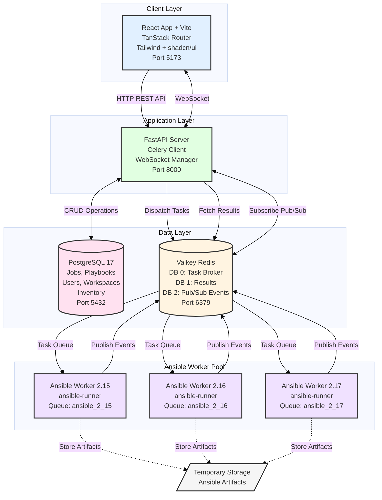

# A-Station

> **Status**: Active Development - Early MVP Stage

A-Station is a visual infrastructure automation platform designed to simplify Ansible playbook execution through a web-based interface with real-time monitoring and workspace management.

## Overview

A-Station provides DevOps teams with a centralized platform for:
- Managing and organizing Ansible playbooks within workspaces
- Executing playbooks asynchronously with real-time status updates
- Monitoring job execution through WebSocket-based log streaming
- Collaborating across teams with workspace-based access control

## Architecture



### Key Design Principles

1. **Clean Separation**: FastAPI has zero Ansible dependencies
2. **Version Flexibility**: Support multiple Ansible versions simultaneously
3. **Real-Time Streaming**: Events flow from worker → Valkey → WebSocket → Browser
4. **Horizontal Scaling**: Add workers per version as needed
5. **Job Isolation**: Each playbook execution runs in its own work directory

## Technology Stack

### Frontend (`a-station-react-app/`)
- **Framework**: React 19 + TypeScript
- **Build Tool**: Vite
- **Routing**: TanStack Router (with context-based auth)
- **UI Library**: Tailwind CSS v4 + shadcn/ui (Radix UI components)
- **Icons**: Lucide React
- **State Management**: React Context API

### Backend (`a-station-fast-api/`)
- **API Framework**: FastAPI (Python 3.11+)
- **Database**: PostgreSQL 17 (via SQLAlchemy ORM)
- **Task Queue**: Celery + Valkey (Redis-compatible)
- **Authentication**: JWT (access tokens + refresh tokens with rotation)
- **Migrations**: Alembic
- **WebSockets**: FastAPI WebSocket support for real-time updates

### Ansible Worker (`ansible-worker/`)
- **Execution Engine**: Ansible Runner 2.3.4
- **Task Processing**: Celery worker
- **Event Streaming**: Custom event handler for real-time log streaming

## Project Structure

```
A-station/
├── a-station-react-app/          # React frontend application
│   ├── src/
│   │   ├── routes.tsx            # TanStack Router configuration
│   │   ├── pages/                # Page components
│   │   │   ├── Dashboard.tsx    # Main dashboard (4-panel layout)
│   │   │   ├── LoginPage.tsx    # Authentication page
│   │   │   └── RegisterPage.tsx # (Stub - not implemented)
│   │   ├── components/           # UI components
│   │   │   ├── DashboardNavbar.tsx
│   │   │   ├── Toolbar.tsx      # Left toolbar
│   │   │   ├── FileTree.tsx     # Playbook browser
│   │   │   ├── Canvas.tsx       # Main editor canvas
│   │   │   └── SecondaryToolbar.tsx
│   │   ├── contexts/             # React contexts
│   │   │   └── AuthContext.tsx  # Authentication state management
│   │   ├── api/                  # API client functions
│   │   │   └── auth-api.ts      # Auth endpoints
│   │   └── index.css            # Custom Tailwind theme
│   └── package.json
│
├── a-station-fast-api/           # FastAPI backend application
│   ├── app/
│   │   ├── api/endpoints/        # REST API endpoints
│   │   │   ├── auth.py          # Authentication routes
│   │   │   ├── workspaces.py    # Workspace management
│   │   │   └── jobs.py          # Job execution & status
│   │   ├── models/               # SQLAlchemy database models
│   │   │   ├── user.py
│   │   │   ├── workspace.py
│   │   │   ├── job.py
│   │   │   ├── playbook.py
│   │   │   ├── inventory.py
│   │   │   └── refresh_token.py
│   │   ├── crud/                 # Database operations
│   │   │   └── job_crud.py
│   │   ├── schemas/              # Pydantic validation schemas
│   │   ├── celery_app/           # Celery configuration
│   │   │   ├── celery_config.py
│   │   │   └── tasks.py
│   │   ├── websockets/           # WebSocket handlers
│   │   │   └── jobs.py          # Real-time job updates
│   │   └── core/                 # Core configuration
│   │       ├── config.py        # Environment settings
│   │       ├── security.py      # JWT & password hashing
│   │       └── database.py      # DB connection
│   ├── docker-compose.yml
│   ├── requirements.txt
│   └── .env.example
│
├── ansible-worker/               # Separate Celery worker for Ansible
│   ├── worker/
│   │   ├── celery_app.py        # Worker configuration
│   │   ├── tasks.py             # Task definitions
│   │   ├── ansible_executor.py  # Ansible Runner wrapper
│   │   └── event_streamer.py    # Real-time event handling
│   ├── dockerfiles/             # Container definitions
│   └── requirements.txt
│
├── implementation-plans/         # Technical design documents
├── graphs/                       # Architecture diagrams
└── README.md
```

## Current Features

### Implemented

**Authentication & User Management**
- JWT-based authentication with access tokens (15-minute expiry)
- Refresh token rotation with family tracking for multi-device support
- Token revocation and automatic cleanup
- Device fingerprinting (user-agent, IP tracking)
- Protected routes with automatic token refresh
- Login/logout endpoints with secure cookie management

**Workspace Management**
- Create, update, and delete workspaces
- Workspace membership with role-based access
- User can belong to multiple workspaces
- Workspace-scoped playbook organization

**Job Execution System**
- Asynchronous playbook execution via Celery
- Job status tracking (pending, running, success, failed)
- Real-time log streaming through WebSockets
- Job history and results storage
- Version-specific Ansible execution (task routing by version)

**Database Models**
- Users, Workspaces, WorkspaceMembers
- Playbooks (YAML storage)
- Jobs (execution records with logs)
- Inventory (hosts, groups, credentials, variables)
- RefreshTokens (session management)

**Frontend Dashboard**
- 4-panel layout: Navbar + Toolbar + FileTree + Canvas + SecondaryToolbar
- Authentication context with auto-refresh
- Login page with form validation
- Protected route handling

### In Progress / Partially Implemented

- Register page (UI exists, functionality stub)
- WebSocket authentication (commented out, needs implementation)
- Email verification (stub endpoint exists)
- Canvas node editor (UI placeholder only)
- File tree playbook loading (static data)

### Planned Features

- Visual workflow editor with drag-and-drop nodes
- Playbook version control and Git integration
- Template library for common automation tasks
- Advanced inventory management UI
- Audit logging and activity feeds
- Team collaboration features

## Getting Started

### Prerequisites

- **Node.js** 20+ (for frontend)
- **Python** 3.11+ (for backend)
- **Docker & Docker Compose** (for infrastructure)
- **Git**

### Environment Setup

1. **Clone the repository**
   ```bash
   git clone <repository-url>
   cd A-station
   ```

2. **Configure environment variables**
   ```bash
   # Backend configuration
   cd a-station-fast-api
   cp .env.example .env
   # Edit .env with your database credentials, JWT secret, etc.
   ```

### Development Mode

#### Option 1: Docker Compose (Recommended)

```bash
cd a-station-fast-api
docker-compose up -d
```

This starts:
- FastAPI backend on `http://localhost:8000`
- PostgreSQL on `localhost:5432`
- Valkey (Redis) on `localhost:6379`

#### Option 2: Manual Setup

**1. Start infrastructure services**
```bash
cd a-station-fast-api
docker-compose up -d db redis
```

**2. Backend setup**
```bash
cd a-station-fast-api

# Create virtual environment
python -m venv venv
source venv/bin/activate  # Windows: venv\Scripts\activate

# Install dependencies
pip install -r requirements.txt

# Run database migrations
alembic upgrade head

# Start API server
uvicorn app.main:app --reload --host 0.0.0.0 --port 8000
```

**3. Start Celery worker** (separate terminal)
```bash
cd a-station-fast-api
source venv/bin/activate
celery -A app.celery_app.celery_config worker --loglevel=info
```

**4. Frontend setup** (separate terminal)
```bash
cd a-station-react-app

# Install dependencies
npm install

# Start development server
npm run dev
```

**5. Access the application**
- Frontend: `http://localhost:5173`
- Backend API: `http://localhost:8000`
- API Documentation: `http://localhost:8000/docs`

## API Endpoints

### Authentication
```
POST   /api/v1/auth/register       # Create new user account
POST   /api/v1/auth/login          # Login (returns access token + refresh cookie)
POST   /api/v1/auth/logout         # Logout current session
POST   /api/v1/auth/logout-all     # Logout all devices
POST   /api/v1/auth/refresh-token  # Refresh expired access token
POST   /api/v1/auth/verify-email   # Email verification (stub)
```

### Workspaces
```
GET    /api/v1/workspaces/         # List user's workspaces
POST   /api/v1/workspaces/create   # Create new workspace
PUT    /api/v1/workspaces/update   # Update workspace details
DELETE /api/v1/workspaces/delete   # Delete workspace
```

### Jobs
```
POST   /api/v1/jobs/               # Create and execute Ansible job
GET    /api/v1/jobs/{job_id}       # Get job status and results
```

### WebSocket
```
WS     /ws/jobs/{job_id}           # Real-time job log streaming
```

### Example: Execute Playbook

```bash
curl -X POST "http://localhost:8000/api/v1/jobs/" \
  -H "Authorization: Bearer YOUR_ACCESS_TOKEN" \
  -H "Content-Type: application/json" \
  -d '{
    "playbook_id": "uuid-here",
    "inventory": {},
    "extra_vars": {"env": "production"}
  }'
```

## Database Schema

### Core Tables
- **users** - User accounts and credentials
- **workspaces** - Team/project containers
- **workspace_members** - User-workspace associations with roles
- **playbooks** - Ansible playbook storage (YAML content)
- **jobs** - Execution history with status and logs
- **refresh_tokens** - JWT refresh token management
- **inventory**, **inventory_groups**, **hosts**, **credentials**, **variables** - Infrastructure configuration

## Authentication Flow

1. **Login**: User submits credentials → Backend returns access token (JSON) + refresh token (HttpOnly cookie)
2. **API Requests**: Frontend includes `Authorization: Bearer <access_token>` header
3. **Token Expiry**: When access token expires (15 min), frontend calls `/refresh-token` with cookie
4. **Token Rotation**: Backend issues new access token + rotates refresh token (family tracking)
5. **Logout**: Backend revokes refresh token family, frontend clears access token

## Development Notes

### Frontend Development
- Custom Tailwind theme defined in `src/index.css` - **DO NOT override theme variables**
- Use shadcn/ui components from `src/components/ui/`
- TanStack Router handles routing with file-based structure
- API base URL configured via `VITE_BASE_URL` environment variable

### Backend Development
- Follow FastAPI dependency injection patterns
- Use Pydantic schemas for request/response validation
- Database sessions managed via dependency injection
- Celery tasks should be idempotent and handle failures gracefully

### Adding New Celery Tasks
```python
# a-station-fast-api/app/celery_app/tasks.py

from .celery_config import celery_app

@celery_app.task(bind=True)
def my_new_task(self, param1: str):
    """Task description"""
    # Implementation
    return result
```

## Security Considerations

- Passwords hashed with bcrypt (cost factor 12)
- JWT tokens signed with HS256 algorithm
- Refresh tokens use secure HttpOnly cookies with SameSite=Lax
- Token family tracking prevents token reuse attacks
- CORS restricted to known origins (localhost:5173, 3000, 8080)
- Ansible execution will run in isolated containers (planned)

## License

[To be determined]

---

**Maintainer**: James Taylor
**Last Updated**: November 2025