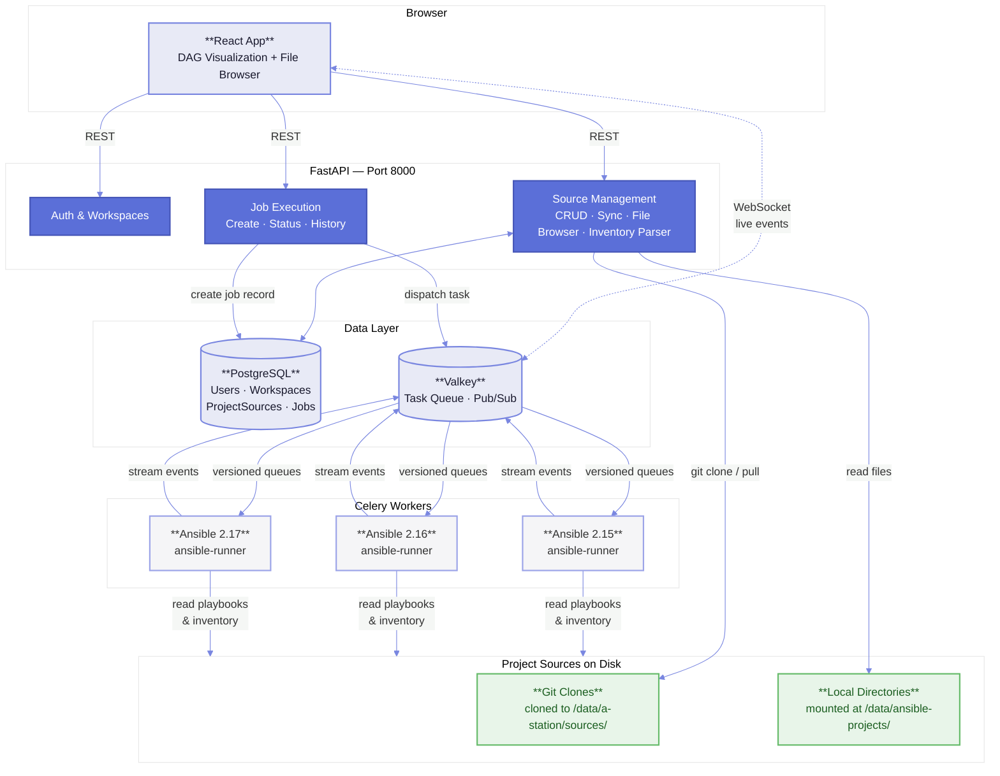

# A-Station

A lightweight, visual execution layer for Ansible. Point it at your playbooks, run them, and watch the results in real-time through a DAG visualization.

A-Station doesn't try to replace Ansible's native file-based workflow — it wraps it. Playbooks and inventory stay where they belong (in your repos, on your filesystem). A-Station handles **execution, visualization, and monitoring**.

## Architecture



## Core Concepts

- **Project Source**: A pointer to a git repo or local directory containing your Ansible playbooks and inventory. A-Station reads from the source — it doesn't store your YAML.
- **Job**: A single execution of a playbook against an inventory. Jobs are queued via Celery, executed by ansible-runner, and streamed to the browser in real-time.
- **Workspace**: Multi-tenant isolation. Each workspace has its own project sources, jobs, and members.

## Features

- Real-time DAG visualization of playbook execution (React Flow)
- Live log streaming via WebSocket
- Multi-version Ansible worker support (2.15, 2.16, 2.17)
- Job history and status tracking
- JWT authentication with refresh token rotation
- Multi-workspace support with role-based access

## Technology Stack

### Frontend (`a-station-react-app/`)
- **Framework**: React 19 + TypeScript
- **Build Tool**: Vite
- **Routing**: TanStack Router
- **Visualization**: React Flow
- **UI**: Tailwind CSS v4 + shadcn/ui
- **State Management**: Zustand

### Backend (`a-station-fast-api/`)
- **API**: FastAPI (Python 3.11+)
- **Database**: PostgreSQL 17 (via SQLAlchemy)
- **Task Queue**: Celery + Valkey (Redis-compatible)
- **Auth**: JWT with refresh token rotation
- **Migrations**: Alembic

### Ansible Worker (`ansible-worker/`)
- **Execution**: ansible-runner
- **Task Processing**: Celery
- **Streaming**: Redis pub/sub → WebSocket

## Getting Started

### Prerequisites

- **Node.js** 20+
- **Python** 3.11+
- **Docker & Docker Compose**

### Quick Start

```bash
# Backend + Infrastructure
cd a-station-fast-api
cp .env.example .env
docker-compose up -d

# Frontend
cd a-station-react-app
npm install
npm run dev
```

**URLs**
- Frontend: http://localhost:5173
- Backend: http://localhost:8000
- API Docs: http://localhost:8000/docs

### Manual Setup (without Docker)

```bash
# Infrastructure
cd a-station-fast-api
docker-compose up -d db redis

# Backend
python -m venv venv && source venv/bin/activate
pip install -r requirements.txt
alembic upgrade head
uvicorn app.main:app --reload

# Celery worker (separate terminal)
celery -A app.celery_app.celery_config worker --loglevel=info

# Frontend (separate terminal)
cd a-station-react-app
npm install && npm run dev
```
