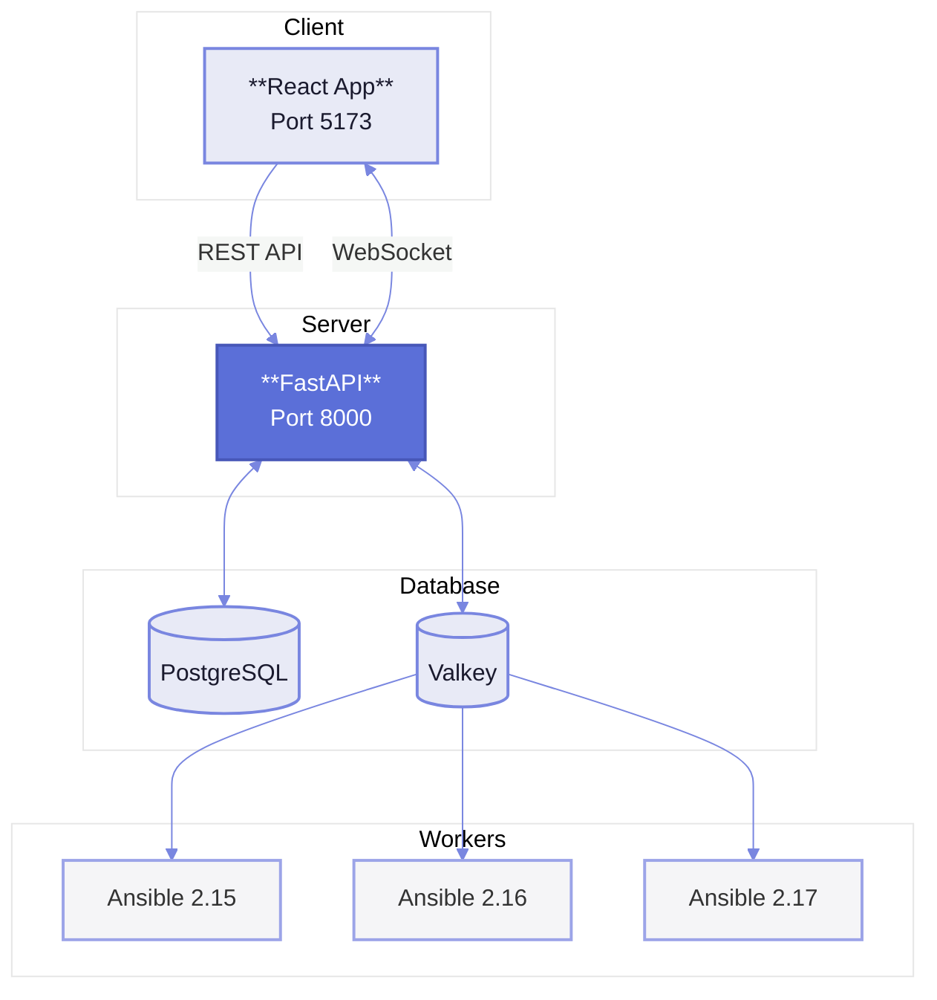

# A-Station

Web-based Ansible automation platform with real-time playbook execution, workspace management, and WebSocket log streaming.

## Architecture



## Technology Stack

### Frontend (`a-station-react-app/`)
- **Framework**: React 19 + TypeScript
- **Build Tool**: Vite
- **Routing**: TanStack Router (with context-based auth)
- **UI Library**: Tailwind CSS v4 + shadcn/ui (Radix UI components)
- **Icons**: Lucide React
- **State Management**: React Context API

### Backend (`a-station-fast-api/`)
- **API Framework**: FastAPI (Python 3.11+)
- **Database**: PostgreSQL 17 (via SQLAlchemy ORM)
- **Task Queue**: Celery + Valkey (Redis-compatible)
- **Authentication**: JWT (access tokens + refresh tokens with rotation)
- **Migrations**: Alembic
- **WebSockets**: FastAPI WebSocket support for real-time updates

### Ansible Worker (`ansible-worker/`)
- **Execution Engine**: Ansible Runner
- **Task Processing**: Celery worker
- **Event Streaming**: Real-time log streaming via WebSocket

## Features

- JWT authentication with refresh token rotation
- Multi-workspace support with role-based access
- Async Ansible playbook execution via Celery
- Real-time log streaming via WebSocket
- Multi-version Ansible worker support (2.15, 2.16, 2.17)
- Job history and status tracking
- React-based dashboard with protected routing

## Getting Started

### Prerequisites

- **Node.js** 20+ (for frontend)
- **Python** 3.11+ (for backend)
- **Docker & Docker Compose** (for infrastructure)
- **Git**

### Quick Start

```bash
# Backend + Infrastructure
cd a-station-fast-api
cp .env.example .env  # Configure environment
docker-compose up -d

# Frontend
cd a-station-react-app
npm install
npm run dev
```

**URLs**
- Frontend: http://localhost:5173
- Backend: http://localhost:8000
- API Docs: http://localhost:8000/docs

### Manual Setup (without Docker)

```bash
# Infrastructure
cd a-station-fast-api
docker-compose up -d db redis

# Backend
python -m venv venv && source venv/bin/activate
pip install -r requirements.txt
alembic upgrade head
uvicorn app.main:app --reload

# Celery worker (separate terminal)
celery -A app.celery_app.celery_config worker --loglevel=info

# Frontend (separate terminal)
cd a-station-react-app
npm install && npm run dev
```

## Development Notes

- API documentation available at http://localhost:8000/docs
- Frontend uses custom Tailwind theme and shadcn/ui components
- Backend uses FastAPI with SQLAlchemy ORM and Pydantic validation
- JWT authentication with bcrypt password hashing
- Celery workers handle async Ansible playbook execution